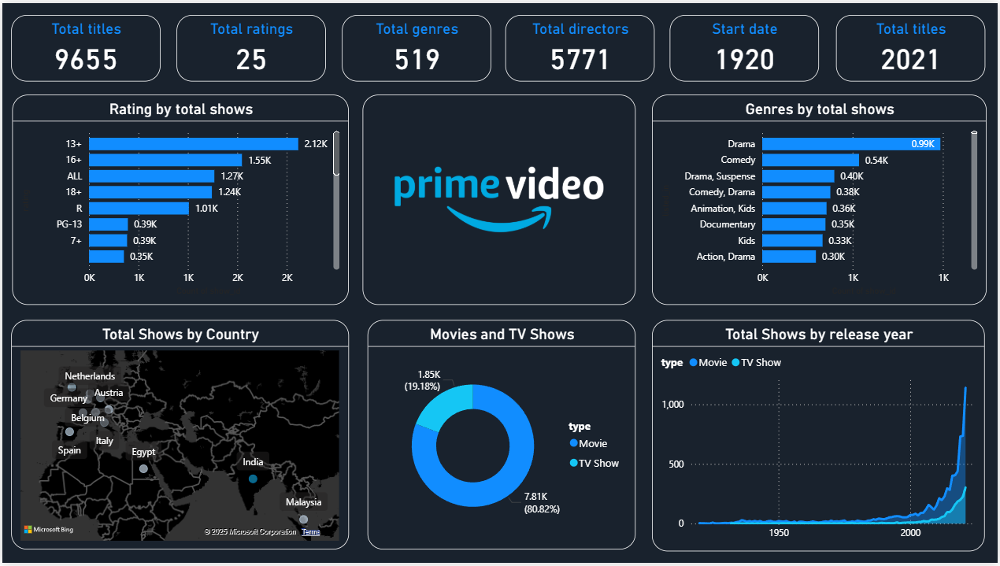

# Amazon Prime Video Dashboard Project

This project presents a Power BI dashboard created using the `amazon_prime_titles.csv` dataset, which contains metadata about Prime Video content such as title type, genre, rating, release year, and country.

---

## Dataset

- **File**: `amazon_prime_titles.csv`
- **Source**: [Kaggle - Amazon Prime Movies and TV Shows](https://www.kaggle.com/datasets/shivamb/amazon-prime-movies-and-tv-shows)
- **Description**: Includes information like title, type (Movie/TV Show), rating, director, cast, release year, genre, and country.

---

## Dashboard Screenshot

---

## Tools Used

- **Power BI** for creating the dashboard
- **Power Query** for data cleaning and transformation
- **CSV** file format as the raw data source

---

## Files in Repository

| File Name                    | Description                             |
|-----------------------------|-----------------------------------------|
| `amazon_prime_titles.csv`   | The dataset used for analysis           |
| `amazon_prime_dashboard.png`| Screenshot of the final Power BI dashboard |
| `amazon_prime_dashboard.pbix` | Power BI dashboard file     |
